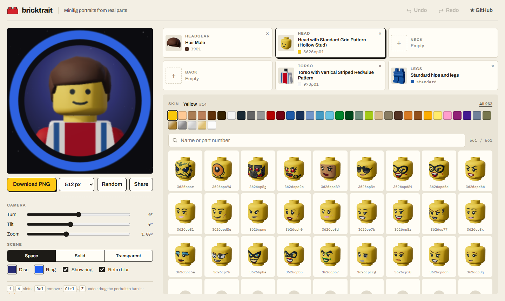

<div align="center">

# bricktrait

**Free minifigure avatar maker: build your minifig profile picture from 3,000+ real parts, right in the browser.**

### [▶ Open bricktrait](https://maxichance.github.io/bricktrait/)

[](https://maxichance.github.io/bricktrait/)
[](https://github.com/Maxichance/bricktrait/actions/workflows/deploy.yml)
[](LICENSE)
[](https://www.ldraw.org/legal-info)

[](https://svelte.dev/docs/kit)
[](https://threejs.org)
[](https://www.typescriptlang.org)



If you like it, a ⭐ helps other people find it.

</div>

bricktrait is a **LEGO® minifigure avatar maker** and **pfp generator** for GitHub, Discord, Twitch or any profile picture. Pick a head, hair or a hat, a beard, a cape, a torso and legs among the real parts of the LDraw library, recolour them, and export a portrait in the style of the classic minifig character select screens.

## Features

- **3,000+ real parts** from the LDraw library: 560 heads, 590 hair pieces, hats and helmets, 90 beards, capes, armour and backpacks, 1,650 torsos and 320 hips and legs, all with their original prints.
- **Six slots always in view**: headgear, head, neck, back, torso and legs, each with its part, colour and part number. Click one to browse its parts, remove any of them with ×.
- **Any colour** from the LDraw palette for skin, headgear, torso, arms, hands, hips and legs.
- **Game portrait look**: starry background, blue ring with its dark inner edge, hard key light and a soft, low-res "video capture" finish. Every bit of it can be turned off or recoloured.
- **Drag to turn, scroll to zoom**, sliders for fine tuning. Zoom out and the portrait turns into the whole figure, legs included.
- **Export** as PNG in 256, 512 or 1024 px, with a transparent background if you want.
- **Share links**: the whole portrait lives in the URL.
- **Undo and redo** (<kbd>Ctrl</kbd>+<kbd>Z</kbd>, <kbd>Ctrl</kbd>+<kbd>Shift</kbd>+<kbd>Z</kbd>), slots on <kbd>1</kbd>–<kbd>6</kbd>, <kbd>Del</kbd> to remove a part.
- **Random** button for when you have no idea.
- Static site, no account, no server, no tracking.

## How it works

```
LDraw parts library ──► scripts/build-parts.mjs ──► static/ldraw/ ──► LDrawLoader ──► WebGL ──► 2D compositing ──► PNG
```

1. `scripts/fetch-ldraw.mjs` downloads the official [LDraw parts library](https://library.ldraw.org).
2. `scripts/build-parts.mjs` picks the minifig heads, headgear, torsos and legs, drops the few that rely on textures (not supported by three.js), and resolves every sub-file they need. Files shared by many parts go into one `core.ldr` loaded once, files shared by a few are served individually, and each part gets a small pack with what is its own (about 32 kB on average).
3. In the browser, three.js' [`LDrawLoader`](https://threejs.org/docs/#examples/en/loaders/LDrawLoader) parses the packs and the parts are assembled with the standard minifig offsets from the LDraw torso shortcuts.
4. The figure is rendered on a transparent canvas, then composited in 2D with the background, the ring and the retro filter.

## Getting started

Requires Node.js 22 or newer.

```sh
git clone https://github.com/Maxichance/bricktrait.git
cd bricktrait
npm ci
npm run parts   # downloads LDraw (~150 MB) into .ldraw/ and builds static/ldraw/
npm run dev
```

`npm run parts` only downloads the library once. Set `LDRAW_DIR` to use a copy you already have.

| Command           | What it does                                           |
| ----------------- | ------------------------------------------------------ |
| `npm run dev`     | Development server                                     |
| `npm run parts`   | Fetch LDraw and generate the parts                     |
| `npm run build`   | Static build in `build/` (`BASE_PATH` for a subfolder) |
| `npm run preview` | Serve the build locally                                |
| `npm run check`   | Type check                                             |
| `npm run lint`    | Prettier check                                         |
| `npm run format`  | Prettier                                               |

## Project structure

```
scripts/
  fetch-ldraw.mjs       download the LDraw library
  build-parts.mjs       select, pack and credit the parts
src/lib/
  ldraw.ts              part loading and minifig assembly
  scene.ts              three.js stage: lights, camera, framing
  compose.ts            background, ring and retro filter
  render.ts             portrait to pixels
  thumbs.ts             part thumbnails
  state.svelte.ts       portrait state, share links, random figure
  history.svelte.ts     undo and redo
  components/           Preview, Slot, PartPicker, ColorBar, Thumb
src/routes/+page.svelte the editor
```

Deployment to GitHub Pages is handled by [`.github/workflows/deploy.yml`](.github/workflows/deploy.yml) on every push to `main`.

## Credits and licences

- **Code**: [MIT](LICENSE) © Maxichance.
- **Parts**: the [LDraw.org Parts Library](https://library.ldraw.org), by its contributors, licensed under [CC BY 2.0](https://creativecommons.org/licenses/by/2.0/) and [CC BY 4.0](https://creativecommons.org/licenses/by/4.0/). The files are repackaged (blank lines removed, references lower-cased), their geometry is not modified. The build ships `CREDITS.txt` with the author and licence of every file, next to the library's `CAreadme.txt` and licence texts.
- **Colours**: `LDConfig.ldr` from the LDraw library, same licence.
- **Libraries**: [three.js](https://github.com/mrdoob/three.js) (MIT), [Svelte and SvelteKit](https://github.com/sveltejs/kit) (MIT), [fflate](https://github.com/101arrowz/fflate) (MIT).
- **Fonts**: [Archivo](https://github.com/Omnibus-Type/Archivo) and [IBM Plex Mono](https://github.com/IBM/plex), both under the SIL Open Font License, self-hosted through Fontsource.

The portrait style is a tribute to the character portraits of the mid-2000s brick video games. No asset from those games is used: everything is rendered from the LDraw models.

> LEGO® is a trademark of the LEGO Group, which does not sponsor, authorize or endorse this project. bricktrait is not affiliated with the LEGO Group, LDraw.org or any game publisher.
